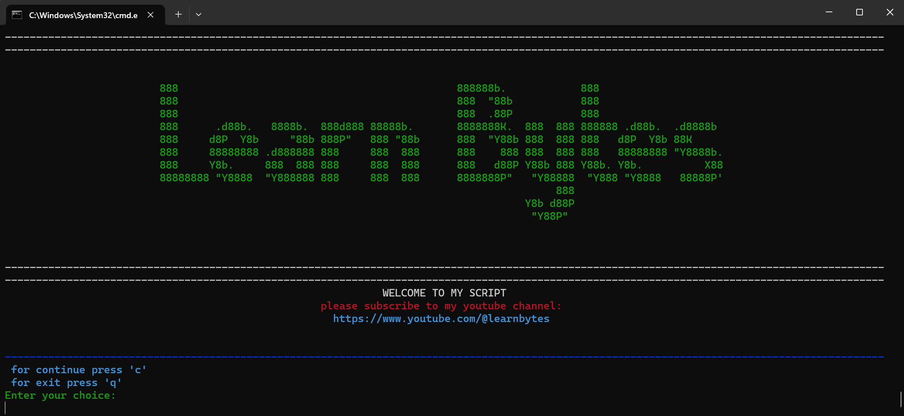
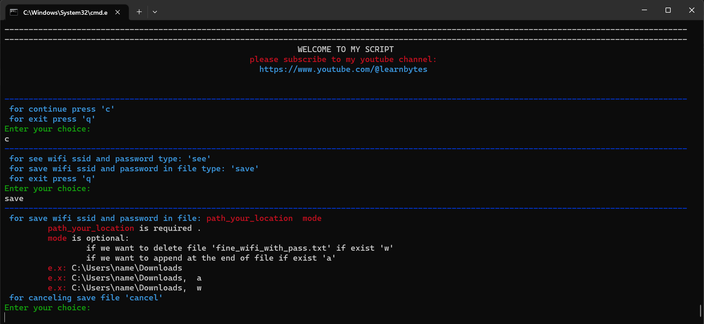

### This script is for Windows users.

***
### requirements:
* python 3.9 or higher
* open terminal and change working directory to directory that script exist
* run `python script.py`
***
## Pictures of the executed code

